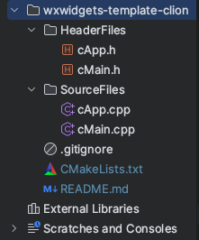
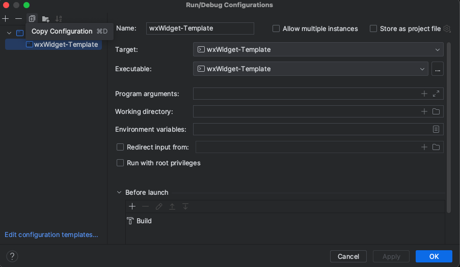

# wxWidgets-template (CLion) for macOS

This is a minimal template I created for CLion to have a starting point using wxWidgets. It just creates a blank window with a title, nothing else.
The reason was I couldn't find any good starting points with a clean structure of header and source files when I started to use wxWidgets. I just needed a simple template.

It was created especially for Mac.
CLion version: 2023.1.1 OSX Ventura 13.0



The easiest way to get started with wxWidgets is either with homebrew or just compile it by yourself.

### Compile yourself
1. Clone the repo or download here: https://www.wxwidgets.org/downloads/
   (if you download, just select: "Source for Linux, macOS, etc")
2. Go to: https://docs.wxwidgets.org/3.2/plat_osx_install.html
3. Follow the instructions.
4. Now you have a folder somewhere called "build-cocoa-debug"
5. In this template CMakeLists.txt

```
set(wxWidgets_ROOT_DIR /Path/To/wxWidgets/wxWidgets-version-x-y-z)
```
#### Notice no ' / ' at the end.

6. Right click on CMakeLists.txt and "Load CMake Project"
7. Done, just click Run/Debug (wxWidget-Template)

If you want to change the Run/Debug name:
Change the name in the "name" field.


